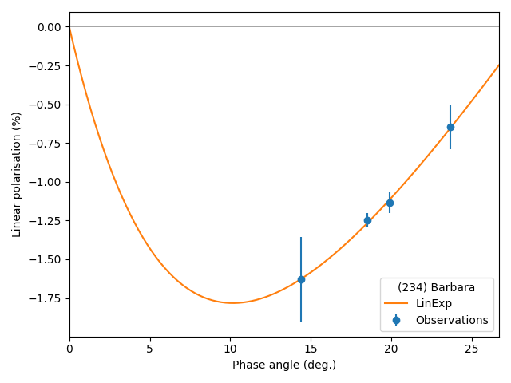
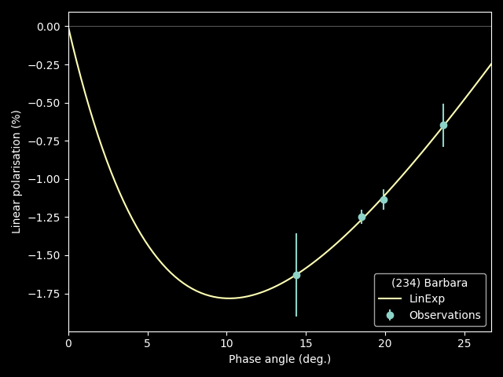

#########
``polka``
#########

.. raw:: html

    

.. role:: gray

A ``python`` package to fit polarimetric phase curves of asteroids.

.. highlight:: python

.. code-block:: python

   import polka

Collect the polarimetry of your favourite asteroid under varying phase angles.

.. code-block:: python

   # Observations of Barbara from Cellino et al. (2005)
   phase = [14.4, 18.5, 19.9, 23.7]
   pol = [-1.63, -1.25, -1.14, -0.65]

Load the observations into ``polka``.

.. code-block:: python

   pc = polka.PhaseCurve(phase=phase, pol=pol)

Fit the traditionnal linear-exponential model to the observations.

.. code-block:: python

   pc.fit()
   pc.plot()

.. toctree::
   :maxdepth: 2
   :caption: Contents
   :hidden:

   Home<self>
   Getting Started<getting_started>
   Basic Usage<core>
   Models<models>
   Release notes<releases>
   Glossary<glossary>

