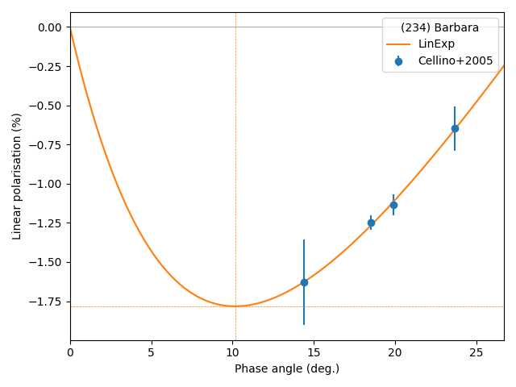
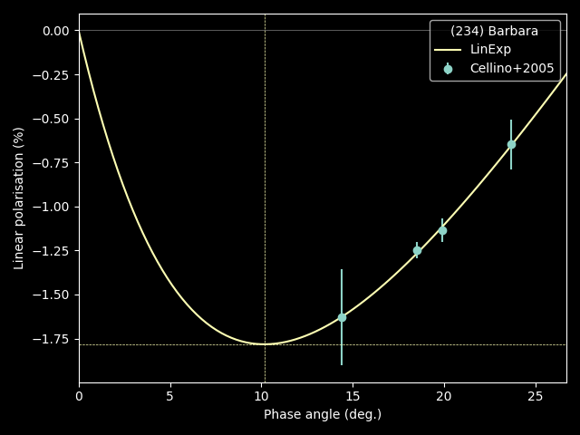

.. _models:

####################
``Models``
####################

.. raw:: html

    

.. role:: gray

.. |br| raw:: html

      

.. highlight:: python

|br|

.. _pol: 

:octicon:`telescope;1em` Linear polarization of asteroid light
===============================================================

The plane of linear polarization of light reflected from an asteroid
should be perpendicular to the scattering plane,
which is defined by the Sun, the asteroid, and the observer
(see, e.g., `Zellner & Gradie (1976) <https://ui.adsabs.harvard.edu/abs/1976AJ.....81..262Z/abstract>`_.
However, coherent backscattering and single-particle scattering can lead to polarization
aligned with the :term:`scattering plane<Scattering plane>`
(see, `Muinonen et al. (2002) <https://ui.adsabs.harvard.edu/abs/2002aste.book..123M/abstract>`_
for a review).

The polarization of asteroids is thus often described by the degree of linear polarization
:math:`P_r`, defined as:

.. math ::
    P_r = \frac{I_{\perp} - I_{||}}{I_{||} + I_{\perp}}

where :math:`I_{||}` and :math:`I_{\perp}` are the intensities of light polarized parallel
and perpendicular to the :term:`scattering plane<Scattering plane>`, respectively.

.. _LinExp: 

:octicon:`graph;1em` Linear-exponential model
=============================================

The linear-exponential model is an empirical model describing
the degree of linear polarization of light :math:`P_r`
reflected from a surface as function of the :term:`phase angle<Phase angle>` (:math:`\alpha`). It was
originally defined by 
`Muinonen et al. (2002) <https://ui.adsabs.harvard.edu/abs/2002MmSAI..73..716M/abstract>`_.
In POLKA, we use the reformulation by
`Devogèle et al. (2017) <https://ui.adsabs.harvard.edu/abs/2017MNRAS.465.4335D/abstract>`_, 
in which :math:`P_r` is null at zero :term:`phase angle<Phase angle>`: 

.. math ::
    P_r = a \left( e^{-\alpha/b} -1 \right) + c \alpha

